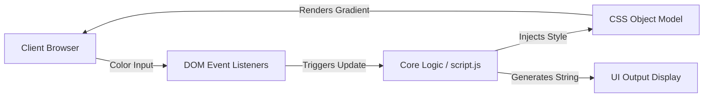

# Background Selector

Generates dynamic CSS background gradients and instantly translates user inputs into precise RGBA strings to accelerate frontend prototyping workflows.

[Live Demo](https://vwdshka.github.io/background-selector/)

## The Problem

Front-end developers and designers frequently lose development velocity manually tweaking hexadecimal and RGBA values to achieve smooth gradient transitions. This system eliminates repetitive trial-and-error styling cycles by providing a real-time, visual control surface that immediately outputs production-ready CSS snippets.

## Architecture



## Quickstart

```bash
git clone https://github.com/vwdshka/background-selector.git
cd background-selector
npx serve .

```

## Design Decisions

* **Vanilla Web Technologies (HTML/CSS/JS):** Chosen over component-heavy frameworks like React or Vue to completely eliminate Virtual DOM reconciliation overhead. Direct DOM manipulation ensures 60 FPS rendering and sub-millisecond execution times for continuous-fire events (e.g., dragging a color picker wheel).
* **100% Client-Side Execution:** Decoupling the application from any backend infrastructure guarantees zero network latency during color selection. It also provides offline availability and enables highly cost-effective, serverless deployment natively via GitHub Pages.
* **Asset Bundling (`bundle.js`):** Leveraging a JavaScript bundler (like Webpack or Browserify) isolates the execution environment and prevents global `window` namespace pollution. This establishes a strictly modular foundation, ensuring scalability if external color-manipulation dependencies are introduced in the future.
